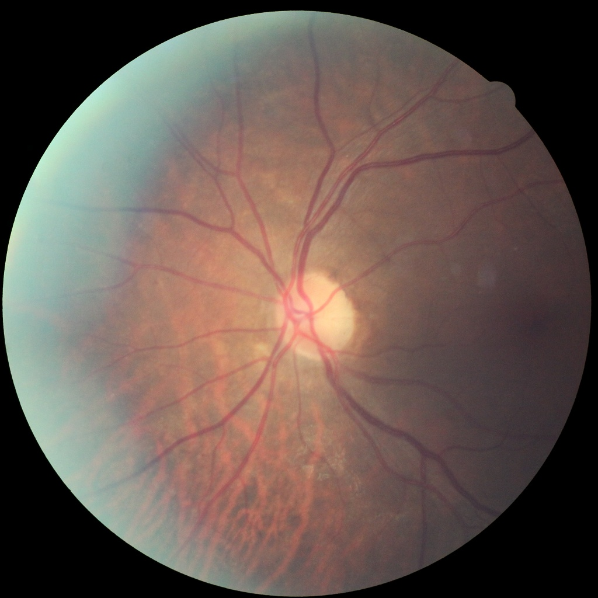
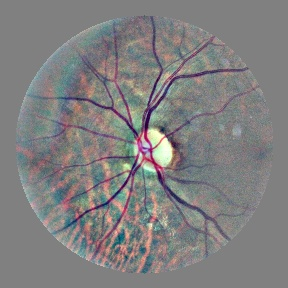
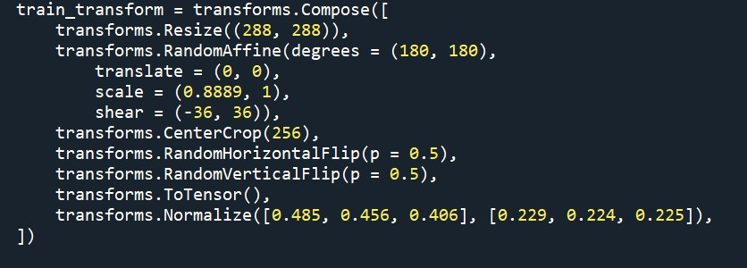
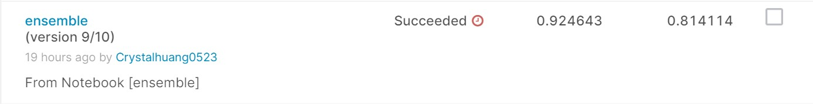

# kaggle-aptos2019-blindness-detection
Our task is [APTOS 2019 Blindness Detection competition](https://www.kaggle.com/c/aptos2019-blindness-detection/overview), the goal of this task is to detect 5 levels of eye illness, normal to severe from 0 to 4. 

## Dataset
The aptos2019 dataset includes 3662 training images and 1929 testing images. Since the data distibution from level 0 to level 4 is unbalanced, so we also apply extra data which is given by [2015 Diabetic Retinopathy](https://www.kaggle.com/prasertsak/dr2015-resized) (resized) photos (38,770 training images) to improve the accuracy.
### Preprocessing
We use [Ben's preprocessing](https://github.com/btgraham/SparseConvNet/tree/kaggle_Diabetic_Retinopathy_competition)
Befor Ben's

After applying Ben's.


### Augmentation
  ---

  <p align="center">
  
  </p>

  ---
##  Train
Use following commands to run ```train.py ```


  ```
python train.py --arch se_resnext50_32x4d
python train.py --arch se_resnext101_32x4d 
python train.py --arch senet15
  ```


### 1st-level models (run on local)
- Models: SE-ResNeXt50_32x4d, SE-ResNeXt101_32x4d, SENet154
- Loss: MSE
- Optimizer: SGD (momentum=0.9)
- LR scheduler: CosineAnnealingLR (lr=1e-3 -> 1e-5)
- 30 epochs
- Dataset: 2019 train dataset (5-folds cv) + 2015 dataset
### 2nd-level models (run on kernel)
- Models: SE-ResNeXt50_32x4d, SE-ResNeXt101_32x4d (1st-level models' weights)
- Loss: MSE
- Optimizer: RAdam
- LR scheduler: CosineAnnealingLR (lr=1e-3 -> 1e-5)
- 10 epochs
- Dataset: 2019 train dataset (5-folds cv) + 2019 test dataset
- Pseudo labels: weighted average of 1st-level models
## Inference
Run ```inference.py``` to get score on kaggle competition, the pretrained weight of the model can be found at https://drive.google.com/file/d/1xdoQg34Pb0HYznd3IcV77a1XJtuNHnME/view?usp=sharing

## Results
We got 0.924643 on private score , and 0.814114 on public score.

  ---

  <p align="center">
  
  </p>

  ---

